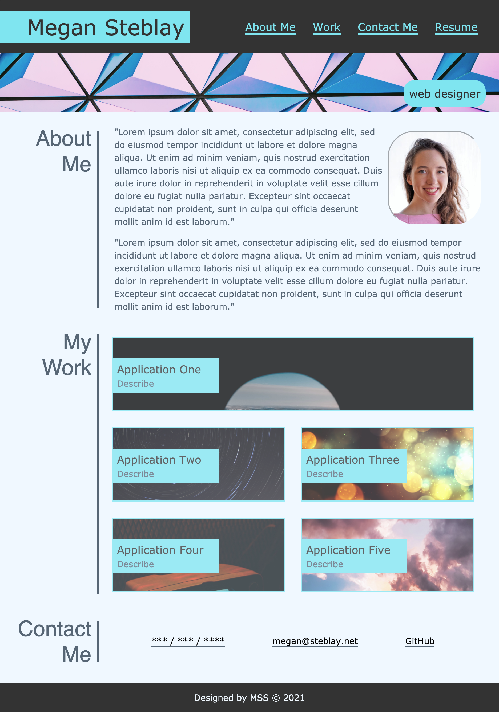

# My Portfolio

## Description

Built from the ground up, this project was completed in order to create a way of showcasing my future work as a portfolio. Through writing HTML and CSS, I built a responsive site that will soon house my coding work and give viewers an idea of who I am.

## Installation

The portfolio webpage has been deployed to a GitHub Pages site ([here](https://msteblu.github.io/portfolio_css/)) where it can be viewed and interacted with. 

Its components (index.html and css files) are also accessible through a download and clone. 

## Usage

Navigate either to the deployed GitHub site ([here](https://msteblu.github.io/portfolio_css/)) or open the index.html file in your browser. Once there, you can access information about me, my contact information, and details on some of my work (forthcoming). 

## License

Licensed under the [MIT](https://github.com/microsoft/vscode/blob/main/LICENSE.txt) license. 